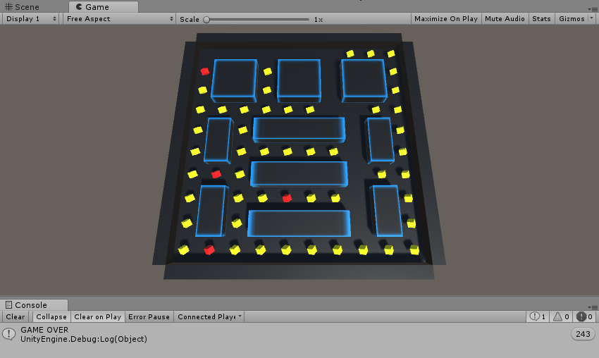

# UnityIntroduction
Taller de Introducción a Unity

## Instalación de Unity
Primero debemos dirigirnos a la página principal de Unity: https://unity3d.com/es. Veremos la opción de <b>"Obtener Unity"</b>, 
hacemos click y podremos elegir nuestra suscripción. Usaremos la versión gratuita seleccionando <b>"Prueba Personal"</b>.

En la siguiente página, tendremos que bajar un poco y veremos la opción de descargar el instalador. Si vamos a usar <b>Unity para Mac OS
X</b> debemos hacer click en <b>"Elige Mac OS X"</b>. No olvides aceptar los Términos de Servicio.

Tras completarse la descargar, iniciamos el instalador y llegaremos a una ventana donde podemos seleccionar lo que queremos instalar.
Marcaremos las siguientes opciones (Si se prefiere usar Visual Studio, puedes marcar la opción para descargarlo con las herramientas
necesarias para Unity):

Seleccionaremos los Build Support de las plataformas para las que vamos a compilar nuestras aplicaciones (Mi recomendación es descargar
todas para no tener que hacerlo más adelante si necesitamos otra plataforma más).

Una vez se complete la descarga podremos ejecutar Unity.

## Desarrollo del proyecto
En este taller de introducción a Unity3D veremos algunos conceptos fundamentales aplicándolo a un "Pac-Man" sencillo.

Una vez hayamos abierto nuestro proyecto de Unity, lo primero que haremos será crear unas carpetas en la ventana de <b>Project</b> para organizar nuestros assets. Para ello, haremos click en <b>Create -> Folder</b> y crearemos 3 carpetas: Scenes, Scripts y Textures. Cuando hayamos hecho esto, deberíamos ver lo siguiente en la ventana Project:

Lo siguiente que haremos será guardar nuestra escena actual en la carpeta Scenes que hemos creado. Para esto podemos usar el comando <b>Ctrl+S</b> o a través de <b>File -> Save Scene</b>. La llamaremos Main.

Tras hacer esto, vamos a colocar la cámara en la escena modificando su propiedad Transform en el inspector. Seleccionamos el objeto Main Camera en la venta Hierarchy y ponemos los siguientes valores:

¡Ya tenemos el set up básico de nuestra escena!
Ahora tenemos que crear el nivel del juego. En primer lugar, crearemos un objeto vacío donde meteremos todos los elementos del escenario, lo llamaremos GameArea. Para crear un GameObject vacío tenemos que seleccionar en la ventana Hierarchy <b>Create -> Create Empty</b>. Podemos resetear su transform para tenerlo en el centro de la escena desde la misma componente, haciendo click en el engranaje de la derecha:

Crearemos además 2 objetos vacíos más que agruparán las paredes interiores y las exteriores. Los llamaremos InsideWalls y OutsideWalls y serán hijos de GameArea (Para eso podemos arrastrar los objetos dentro de GameArea en la ventana Hierarchy).

Ahora pasamos a crear los objetos del escenario.
Lo primero es colocar el suelo, para lo que usaremos un plano, que podemos crear en la ventana <b>Hierarchy -> Create -> 3D Object -> Plane</b> y lo haremos hijo de GameArea. El suelo será negro, para cambiar su material, desplegamos la pestaña Materials en su componente Mesh Renderer y cambiamos el material Default por Black (dentro de la carpeta Materials). Para cambiar el material podemos arrastrar Black al campo Element 0 dentro del Mesh Renderer. Nuestro suelo debe tener las siguientes propiedades:

Ya solo queda crear las paredes. En este caso usaremos cubos, que podemos crear con <b>Create -> 3D Object -> Cube</b>. Le cambiamos el nombre a Wall y lo hacemos hijo de InsideWalls. Repetimos esto mismo para OutsideWalls.
En InsideWalls duplicaremos el objeto Wall hasta tener 10 cubos y en OutsideWalls necesitaremos 4 paredes. Los valores de cada Transform podemos verlo en las siguientes tablas:

<table summary="InsideWalls Transforms">
  <thead>
    <tr>
      <th colspan="3">InsideWalls</th>
    </tr>
    <tr>
      <th>Game Object</th>
      <th>Position</th>
      <th>Scale</th>
    </tr>
  </thead>
  <tbody>
    <tr>
      <td>Wall</td>
      <td>(0, 0.25, 3)</td>
      <td rowspan="3">(2, 0.5, 2)</td>
    </tr>
    <tr>
      <td>Wall(1)</td>
      <td>(3, 0.25, 3)</td>
    </tr>
    <tr>
      <td>Wall(2)</td>
      <td>(-3, 0.25, 3)</td>
    </tr>
    <tr>
      <td>Wall(3)</td>
      <td>(0, 0.25, 0.5)</td>
      <td rowspan="3">(4, 0.5, 1)</td>
    </tr>
    <tr>
      <td>Wall(4)</td>
      <td>(0, 0.25, -1.5)</td>
    </tr>
    <tr>
      <td>Wall(5)</td>
      <td>(0, 0.25, -3.5)</td>
    </tr>
    <tr>
      <td>Wall(6)</td>
      <td>(3.5, 0.25, 0)</td>
      <td rowspan="4">(1, 0.5, 2)</td>
    </tr>
    <tr>
      <td>Wall(7)</td>
      <td>(-3.5, 0.25, 0)</td>
    </tr>
    <tr>
      <td>Wall(8)</td>
      <td>(3.5, 0.25, -3)</td>
    </tr>
    <tr>
      <td>Wall(9)</td>
      <td>(-3.5, 0.25, -3)</td>
    </tr>
  </tbody>
</table>

<table summary="OutsideWalls Transforms">
  <thead>
    <tr>
      <th colspan="3">OutsideWalls</th>
    </tr>
    <tr>
      <th>Game Object</th>
      <th>Position</th>
      <th>Scale</th>
    </tr>
  </thead>
  <tbody>
    <tr>
      <td>Wall</td>
      <td>(0, 0, 5.25)</td>
      <td rowspan="2">(10, 1, 0.5)</td>
    </tr>
    <tr>
      <td>Wall(1)</td>
      <td>(0, 0, -5.25)</td>
    </tr>
     <tr>
      <td>Wall(2)</td>
      <td>(5.25, 0, 0)</td>
      <td rowspan="2">(0.5, 1, 10)</td>
    </tr>
    <tr>
      <td>Wall(3)</td>
      <td>(-5.25, 0, 0)</td>
    </tr>
</table>

La rotación la dejaremos a (0, 0, 0) en todos los objetos.
Al igual que el suelo, las paredes exteriores tendrán el material Black y el de las interiores vamos a dejarlo por ahora en el Default.
Una vez hayamos colocado todos los objetos tendremos una escena como la siguiente (Visto desde la ventana Game):

Y la jerarquía de nuestra escena sería:

A continuación, crearemos un nuevo material para las paredes interiores. Primero tenemos que importar la textura BlueBorder que se encuentra en la carpeta Textures. Para ello, hacemos click derecho en la carpeta Textures dentro de Project y seleccionamos <b>Import New Asset</b>.
Ahora crearemos el nuevo material. Hacemos click derecho en la carpeta Materials y seleccionamos <b>Create -> Material</b> y le llamamos BlueBorder. Una vez hayamos hecho esto, deberíamos ver lo siguiente en nuestra ventana Project:

Para asignarle la textura al material podemos arrastrar la misma a la izquierda del campo Albedo del material que hemos creado:

Seleccionamos todas las paredes interiores y le aplicamos el material.
Lo que nos queda es crear al jugador, los puntos y los enemigos. Empezaremos por el jugador.
Creamos una esfera (<b>Create -> 3D Object -> Sphere</b>) y le llamamos Player.
Para mover al personaje usaremos el sistema de físicas de Unity, aplicando fuerzas para hacer la esfera girar por el escenario, por lo que tendremos que añadirle un componente Rigidbody, que además nos permitirá trabajar con colisiones. Hacemos click en <b>Add Component -> Physics -> Rigidbody</b>. El jugador quedaría así:

Ahora vamos a hacer que nuestro personaje se mueva, por lo que, ¡Vamos con nuestro primer script!
Para crear un script hacemos click derecho en la carpeta Scripts y seleccionamos <b>Create -> C# Script</b>. Lo llamaremos PlayerController y lo primero que haremos será añadir una propiedad pública para que podamos modificarla en el inspector con la que controlaremos la velocidad de nuestro personaje. Será de tipo float y la llamaremos speed.
A continuación añadimos las siguientes líneas en el Update, con lo que podremos mover a nuestro personaje con las flechas del teclado aplicando fuerzas al Rigidbody:

Añadiremos el script al objeto Player y cambiamos la variable speed por 5. Nuestro personaje quedaría así:

Podemos darle al botón de play que hay en la parte superior y probar que funciona.

Si todo va bien, continuaremos con los puntos y los enemigos. Para no tener que ir colocando uno a uno, hay dos prefabs en la carpeta Prefabs. Basta con arrastrar los dos prefabs a la escena y ya los tendremos colocados (Los cubos amarillos serán los puntos y los rojos los enemigos). Debería quedar nuestra escena así:

Para darles movimiento a los cubos, crearemos un nuevo script al que llamaremos ObjectRotation. Este será muy simple, modificaremos en cada frame la rotación de los cubos usando el método Rotate de la clase Transform:

Se lo añadimos a todos los enemigos y puntos y le asignamos a la variable speed un valor de 2. Por ejemplo, los enemigos quedarían así:

Si lo probamos, podremos observar cómo se mueven los cubos continuamente, sin embargo, nuestro jugador los atraviesa y no ocurre nada. Vamos a añadir a nuestro PlayerController un método OnTriggerEnter con el que detectaremos si choca con un punto o un enemigo según el tag y lo destruya.

Si probamos los cambios que hemos hecho veremos que cada vez que tocamos un punto nos aparece un mensaje en la consola:

Ya va cogiendo forma nuestro Pac-Man, pero todavía nos hace falta controlar cuando hemos ganado o perdido. Así que crearemos un nuevo script que se llamará GameController. Definiremos 2 variables estáticas para controlar las vidas y la puntuación. Cuando se hayan conseguido todos los puntos se mostrará un mensaje de victoria en la consola y si se pierden 3 vidas se mostrará un mensaje de Game Over. El script quedará así:

Crearemos un nuevo GameObject al que llamaremos GameController y le añadimos el nuevo script. En el inspector tendremos que referenciar a nuestro personaje, así que arrastramos el objeto correspondiente al campo del script GameController en el inspector, quedando así:

Además, tendremos que modificar el método OnTriggerEnter del PlayerController para que modifique las vidas y la puntuación cuando corresponda:

Guardamos todas las modificaciones y lo probamos. Veremos que cuando perdemos 3 vidas aparece un mensaje de Game Over en la consola y desaparece nuestro personaje:

Ya sabemos cuándo hemos ganado y cuándo hemos perdido, pero no sabemos cuántos puntos o cuántas vidas tenemos. Vamos a usar la UI de Unity.
Lo primero es crear un Canvas, donde meteremos los textos que usaremos. Para crearlo, seleccionaremos <b>Create -> UI -> Canvas</b>. Lo llamaremos UI, le cambiaremos el Render Mode del componente Canvas a World Space y asignaremos los siguientes valores en el Rect Transform:

Dentro de nuestro Canvas, añadiremos 3 textos seleccionando <b>Create -> UI -> Text</b>. Los llamaremos ScoreText, LivesText y EndText. Sus posiciones serán (0, 40, 0), (0, -350, 0) y (0, -150, 0) respectivamente. Las propiedades del texto serán las siguientes para los 3:

Para distinguirlos podemos poner para cada uno SCORE X, LIVES X y el EndText lo dejaremos vacío.
Nos quedaría una escena así:

Ahora modificaremos el GameController para que muestre la puntuación y las vidas a través de la UI. Para usar los componentes de la UI, tendremos que importarlos (using UnityEngine.UI).

Tendremos que hacer referencia a los textos en el inspector, para ello los arrastramos a los campos correspondientes, quedando nuestro GameController tal y como se muestra en la siguiente imagen:

Si lo probamos veremos que ahora nos muestra todo a través de los textos que hemos creado:

¡Ya casi hemos terminado!
Lo último que haremos será modificar el GameController para reiniciar el juego con la R cuando termine la partida y salir del mismo con la tecla Escape. Usaremos el SceneManagement.

Lo probamos y cuando ganamos veremos la siguiente pantalla:

Ya solo queda compilar el juego y sacar el ejecutable. Para ello, nos vamos a <b>File -> Build Settings</b>. Nos aparecerá una pantalla en la que podremos añadir las escenas que queremos incluir en el compilado. Pulsamos <b>Add Open Scenes</b> para agregar nuestra escena Main y hacemos click en Build.

Cuando el proceso acabe nos generará el ejecutable, además de una carpeta Data, que siempre debe estar junto al ejecutable.
¡Y ya estaría!

## Retos
Una vez finalizado el proyecto, os propongo unos retos para que ampliéis los conocimientos adquiridos en el taller:
- Agregar uno o más niveles. Al pasar de nivel se guarda la puntuación y las vidas que tiene el jugador. Usar <b>DontDestroyOnLoad</b>.
- Añadir enemigos que se muevan por el nivel siguiendo al personaje con <b>NavMesh</b>.
- Guardar récords con <b>PlayerPrefs</b>.
